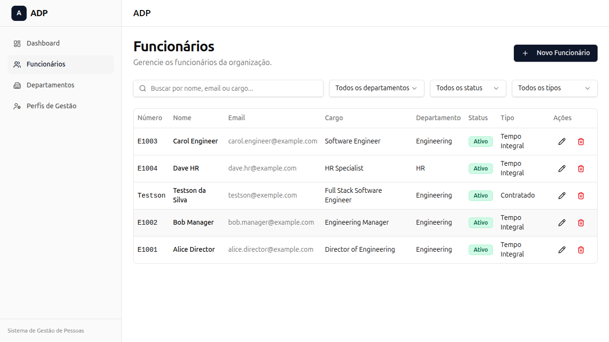

# ADP Challenge — Frontend

Web interface for the ADP Challenge people management system, consuming all features from the REST API.

**Backend API:** [otto-Schmitz/adp-challenge](https://github.com/otto-Schmitz/adp-challenge)

---

## Preview

### Employees page



Full CRUD with search, filters (department, status, employment type), pagination, and modal forms for create/edit.

---

## Tech stack

| Technology | Purpose |
|---|---|
| **React 19** | UI library |
| **Vite 6** | Bundler and dev server |
| **TypeScript** | Static typing |
| **Tailwind CSS v4** | Utility-first styling |
| **shadcn/ui** | UI components (Radix UI + cva) |
| **TanStack Query** | Data fetching, caching and mutations |
| **Axios** | HTTP client |
| **Zod** | Form validation |
| **React Hook Form** | Form state management |
| **React Router v6** | Client-side routing |
| **Lucide React** | Icons |
| **Sonner** | Toast notifications |

---

## Features

- **Dashboard** with summary cards (total employees, departments and manager profiles)
- **Employee CRUD** with search, filters (department, status, employment type), pagination, and modal forms
- **Department CRUD** with detail page showing department employees
- **Manager Profile CRUD** with employee names and budgets formatted in BRL
- **Responsive sidebar** with navigation and mobile toggle
- **Delete confirmation** via AlertDialog
- **Toast notifications** for all success/error operations
- Manager dropdown filtered: only employees with a manager profile can be selected as manager

---

## Getting started

**Prerequisites:** Node.js (v20+) and npm. The [backend API](https://github.com/otto-Schmitz/adp-challenge) must be running on port 3000.

1. **Install dependencies**
   ```bash
   npm install
   ```

2. **Start the dev server**
   ```bash
   npm run dev
   ```
   The frontend runs at **http://localhost:5173** and proxies `/api` requests to `http://localhost:3000`.

3. **Production build**
   ```bash
   npm run build
   npm run preview
   ```

---

## Project structure

```
frontend/
├── src/
│   ├── api/                  # API services (employees, departments, manager-profiles)
│   ├── components/
│   │   ├── layout/           # AppLayout with responsive sidebar
│   │   ├── ui/               # shadcn/ui components (button, dialog, table, select, etc.)
│   │   ├── employees/        # Employee table, filters and form
│   │   ├── departments/      # Department table and form
│   │   └── manager-profiles/ # Manager profile table and form
│   ├── hooks/                # TanStack Query hooks for each entity
│   ├── lib/                  # Axios instance, utilities (cn, formatDate, formatCurrency)
│   ├── pages/                # Dashboard, Employees, Departments, ManagerProfiles
│   ├── schemas/              # Zod schemas for form validation
│   └── types/                # TypeScript types and label maps
├── index.html
├── vite.config.ts
├── tsconfig.json
└── package.json
```

---

## Scripts

| Command | Description |
|---|---|
| `npm run dev` | Start development server (Vite) |
| `npm run build` | Production build |
| `npm run preview` | Preview production build |
